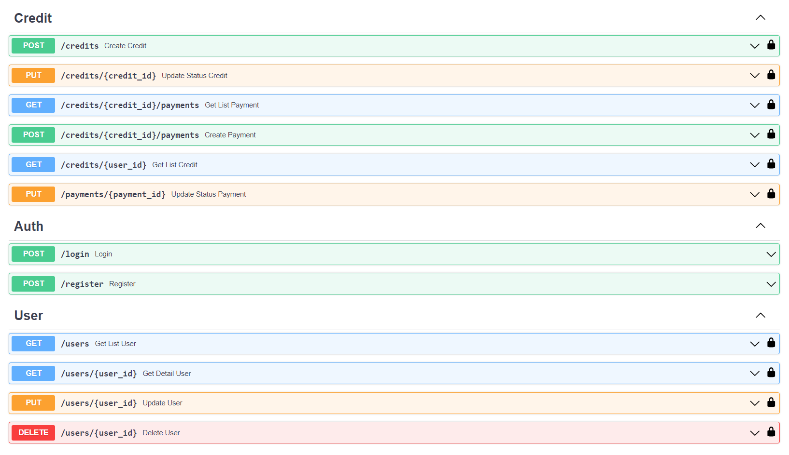
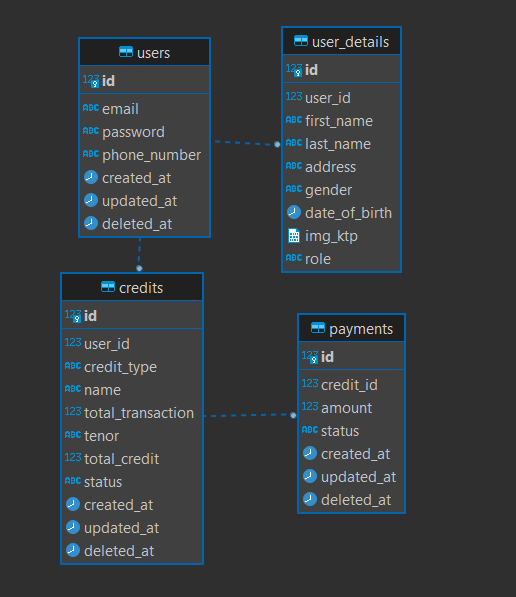

# Elspasial Skill Test: Credit App

This app is for skill technical test purposes. The Credit App is an API for managing credit application transactions up to the repayment stage.

# This app has implemented:

- Use prepared statement in every query execution to prevent SQL Injection.
- Validate every request client to prevent XSS (Cross-Site Scripting) attacks.
- Implementation of Clean Architecture for scalability and independence of frameworks. Which is this project has 4 layers: Domain, Service, Repository, and Handler.

# Dependencies

| **Tech**                                                               | **Description**                                                                                             |
| ---------------------------------------------------------------------- | ------------------------------------------------------------------------------------------------------------|
| [fiber](https://github.com/gofiber/fiber)                              | Fiber is an Express inspired web framework built on top of Fasthttp, the fastest HTTP engine for Go.        |
| [godotenv](https://github.com/joho/godotenv)                           | A Go (golang) port of the Ruby dotenv project (which loads env vars from a .env file).                      |
| [sqlx](https://github.com/jmoiron/sqlx)                                | sqlx is a library which provides a set of extensions on go's standard database/sql library.                 |
| [pq](https://github.com/lib/pq)                                        | pq - A pure Go postgres driver for Go's database/sql package                                                | 
| [jwt](https://github.com/golang-jwt/jwt)                               | A go (or 'golang' for search engine friendliness) implementation of JSON Web Tokens.                        |    
| [bcrypt](https://cs.opensource.google/go/x/crypto)                     | Package bcrypt implements Provos and Mazières's bcrypt adaptive hashing algorithm.                          |
| [swag](https://github.com/swaggo/swag#swag)                            | Swag converts Go annotations to Swagger Documentation 2.0.                                                  |

# Prerequisites

- Go
- PostgreSQL
- Shell that support `make`

# Installation

In order to run this application, you just need to do the following commands.

- Clone the repository

```bash
$ git clone git@github.com:kharismajanuar/credit-app.git
```

- Switch to this repository

```bash
$ cd credit-app
```

- Modify the env.example file with your environment

- Run the application

```bash
$ make run
```

- Go to `/swagger` endpoint to view the swagger documentation. Example: http://localhost:3003/swagger

# API Endpoints / Features



# ERD


